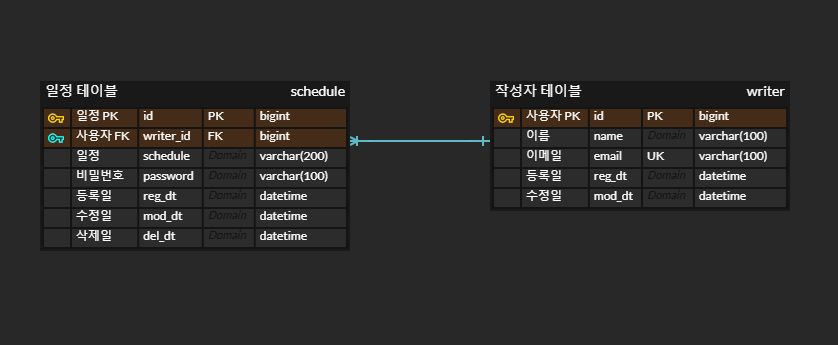

# 스파르타 내임배움캠프 일정 관리 

--- 
## 차례

[과제내용](#과제-내용)

[ERD](#ERD)

[Swagger](#Swagger-URL)

[Schedule API 명세서](#Schedule-API-명세서)

[Writer API 명세서](#Writer-API-명세서)

---
## 과제 내용

### ✅ 기본 구현 요구사항 (필수)

#### 1️⃣ 일정 생성
- 일정 등록 시 저장 데이터:
  - 할일 내용
  - 작성자명
  - 비밀번호
  - 작성일/수정일 (날짜와 시간 포함)
- 일정 고유 ID 자동 생성
- 최초 입력 시 작성일 = 수정일

#### 2️⃣ 전체 일정 조회
- 조건부 조회 가능:
  - 수정일(YYYY-MM-DD 형식)
  - 작성자명
- 조건은 각각 또는 모두 선택 가능
- `수정일` 기준 내림차순 정렬

#### 3️⃣ 선택 일정 조회
- ID로 특정 일정 단건 조회

#### 4️⃣ 일정 수정
- 수정 가능 항목: `할일`, `작성자명`
- 수정 시 `비밀번호` 확인
- `작성일`은 수정 불가, `수정일`은 현재 시각으로 갱신

#### 5️⃣ 일정 삭제
- 삭제 시 `비밀번호` 확인 필요

---

### 🚀 도전 기능 (선택)

#### 1️⃣ 작성자와 일정의 연관관계 설정
- 작성자 테이블 별도 관리 (이름, 이메일, 등록일, 수정일)
- 작성자 고유 ID로 일정과 연관

#### 2️⃣ 페이지네이션
- `페이지 번호`, `페이지 크기`로 조회
- 작성자 이름 포함
- 범위 초과 시 빈 배열 반환

#### 3️⃣ 예외 처리
- 비밀번호 불일치, 일정 조회 실패 시 예외 발생
- HTTP 상태 코드와 에러 메시지 반환
- `@ExceptionHandler`로 공통 예외 처리

#### 4️⃣ 유효성 검사

---

### 📋Languages


### 📚 Frameworks, Platforms and Libraries


### 💾 Databases


### 🥅 Other


---
## 📝ERD


---

## 🔍Swagger URL

```
/swagger-ui/index.html#
```
---
## 📂Schedule API 명세서

### 🔍 Base URL

```
/api/schedule
```

---

### ✅ API 목록 요약

| Method | Endpoint           | 설명              |
|--------|--------------------|-----------------|
| POST   | /api/schedule      | 일정 등록           |
| GET    | /api/schedule      | 일정 목록 조회 (페이징)  |
| GET    | /api/schedule/{id} | 일정 상세 조회        |
| PUT    | /api/schedule/{id} | 일정 수정           |
| DELETE | /api/schedule/{id} | 일정 삭제 (비밀번호 검증) |

---

### ✅ 1. 일정 등록

- **URL** : `POST /api/schedule`
- **요청 Body 필드**
- | 필드명   | 타입     | 필수 | 설명               |
  |---------|--------|------|------------------|
  | schedule | String | O    | 일정 내용            |
  | password | String | O    | 비밀번호 (삭제/수정 검증용) |
  | email | String | O    | 작성자 이메일          |

- **Body Example (JSON)**

```json
{
  "schedule": "string",
  "password": "string",
  "email": "string"
}
```

- **Response Example**

```json
{
  "data": {
    "id": 0,
    "schedule": "string",
    "writerNm": "string",
    "email": "string",
    "regDt": "string",
    "modDt": "string"
  },
  "result": {
    "status": 200,
    "code": "A000",
    "message": "요청 처리 성공"
  }
}
```

---

### ✅ 2. 일정 목록 조회

- **URL** : `GET /api/schedule`
- **Query Params**
- | 필드 | 타입 | 필요 | 설명 |
  |--------|------|------|------|
  | writerId | Long | 선택 | 작성자 PK |
  | modDt | String(yyyy-MM-dd) | 선택 | 수정일 조회 |
  | page | int | 선택 (기본 1) | 페이지 번호 (1부터) |
  | size | int | 선택 (기본 10) | 페이지 크기 (최대 100) |

- **Response Example**

```json
{
  "data": {
    "data": [
      {
        "id": 0,
        "schedule": "string",
        "writerNm": "string",
        "email": "string",
        "regDt": "yyy-MM-dd HH:mm",
        "modDt": "yyy-MM-dd HH:mm"
      }
    ],
    "total": 0,
    "size": 10,
    "page": 1,
    "totalPages": 0
  },
  "result": {
    "status": 200,
    "code": "A000",
    "message": "요청 처리 성공"
  }
}
```

---

### ✅ 3. 일정 상세 조회

- **URL** : `GET /api/schedule/{id}`

- **Response Example**

```json
{
  "data": {
    "id": 1,
    "schedule": "string",
    "writerNm": "string",
    "email": "string",
    "regDt": "yyy-MM-dd HH:mm",
    "modDt": "yyy-MM-dd HH:mm"
  },
  "result": {
    "status": 200,
    "code": "A000",
    "message": "요청 처리 성공"
  }
}
```

---

### ✅ 4. 일정 수정

- **URL** : `PUT /api/schedule/{id}`
- **Body Example (JSON)**

```json
{
  "schedule": "string",
  "password": "string"
}
```

- **Response Example**

```json
{
  "data": {
    "id": 1,
    "schedule": "string",
    "writerNm": "string",
    "email": "string",
    "regDt": "yyy-MM-dd HH:mm",
    "modDt": "yyy-MM-dd HH:mm"
  },
  "result": {
    "status": 200,
    "code": "A000",
    "message": "요청 처리 성공"
  }
}
```

---

### ✅ 5. 일정 삭제 (Delete Schedule)

- **URL** : `DELETE /api/schedule/{id}`
- **Body Example (JSON)**

```json
{
  "password": "string"
}
```

- ✔ 성공 시 Boolean 반환

```json
{
  "data": true,
  "result": {
    "status": 200,
    "code": "A000",
    "message": "요청 처리 성공"
  }
}
```

---
## 📂Writer API 명세서
### 🔍 Base URL

```
/api/writer
```

---

### ✅ API 목록 요약

| Method | Endpoint           | 설명        |
|--------|--------------------|-----------|
| POST   | /api/writer        | 작성자 등록    |
| GET    | /api/writer/{id} | 작성자 상세 조회 |

---

### ✅ 1. 작성자 등록

- **URL** : `POST /api/writer`
- **요청 Body 필드**
- | 필드명      | 타입     | 필수 | 설명   |
  |----------|--------|------|------|
  | name     | String | O    | 이름  |
  | email    | String | O    | 이메일 |

- **Body Example (JSON)**

```json
{
  "name": "string",
  "email": "string"
}
```

- **Response Example**

```json
{
  "data": {
    "id": 0,
    "name": "string",
    "email": "string",
    "regDt": "yyyy-MM-dd HH:mm:ss",
    "modDt": "yyyy-MM-dd HH:mm:ss"
  },
  "result": {
    "status": 200,
    "code": "A000",
    "message": "요청 처리 성공"
  }
}
```

---
### ✅ 2. 작성자 상세 조회

- **URL** : `GET /api/writer/{id}`

- **Response Example**

```json
{
  "data": {
    "id": 0,
    "name": "string",
    "email": "string",
    "regDt": "yyyy-MM-dd HH:mm:ss",
    "modDt": "yyyy-MM-dd HH:mm:ss"
  },
  "result": {
    "status": 200,
    "code": "A000",
    "message": "요청 처리 성공"
  }
}
```
---
### ✅ 2. 작성자 상세 조회

- **URL** : `GET /api/writer/{id}`

- **Response Example**

```json
{
  "data": {
    "id": 0,
    "name": "string",
    "email": "string",
    "regDt": "yyyy-MM-dd HH:mm:ss",
    "modDt": "yyyy-MM-dd HH:mm:ss"
  },
  "result": {
    "status": 200,
    "code": "A000",
    "message": "요청 처리 성공"
  }
}
```
---
### ✅ 3. 작성자 수정

- **URL** : `PUT /api/writer/{id}`
- **Body Example (JSON)**

```json
{
  "name": "string"
}
```

- **Response Example**

```json
{
  "data": {
    "id": 0,
    "name": "string",
    "email": "string",
    "regDt": "yyyy-MM-dd HH:mm:ss",
    "modDt": "yyyy-MM-dd HH:mm:ss"
  },
  "result": {
    "status": 200,
    "code": "A000",
    "message": "요청 처리 성공"
  }
}
```

---
## ⚠️ 개발자 참고 - 예외 처리

| HTTP Status | 설명                     |
|-------------|------------------------|
| 200         | 성공                     |
| 400         | 잘못된 요청 / 파라미터 오류       |
| 401         | 비밀번호 불일치 (PW_MISMATCH) |
| 404         | 데이터 없음                 |
| 500         | 에러                     |

- 📌 모든 실패 응답은 `BaseResponse`로 감싸서 내려감

---

### 📤 공통 응답 형식 (BaseResponse)

```json
{
  "data": {},
  "result": {
    "status": 200,
    "code": "코드",
    "message": "메시지"
  }
}
```

---